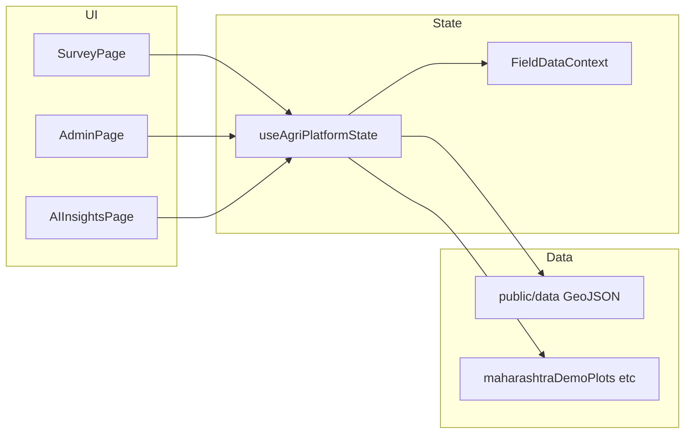

# CropGen Monitoring Dashboard

Hackathon-ready **field + satellite monitoring** workspace for Maharashtra: survey intelligence (maps and charts), government admin console (KPIs, schemes, alerts), and AI cluster insights — built with **React 19**, **Vite 7**, **Tailwind CSS 4**, **Leaflet / react-leaflet**, and **Recharts**.

---

## Quick start

```bash
npm install
npm run dev
```

Open the URL shown in the terminal (default `http://localhost:5173`).

**API hosts (optional white-label):** Set `VITE_API_BASE_URL` and `VITE_LOCATION_API_ORIGIN` in a `.env` file to point at your backends. Defaults match the original demo servers.

**Production build:**

```bash
npm run build
npm run preview
```

---

## 3-minute demo script (judges)

1. **Landing** — Expand **“Why this monitoring platform”** under the search bar for problem / signals / personas / outcomes.
2. **Survey** (`/survey`) — Keep default **Washim** + **soybean** context. Toggle **Survey layers**: Crop classification → NDVI → Drought & stress. Click a polygon; confirm detail cards and charts below reflect selection.
3. **Admin** (`/admin`) — Open **Farmer mapping**: switch map overlay to **AI risk zones**; select a plot and scroll farmer / land / government blocks. Skim **Dashboard**, **Schemes**, **Alerts**, **Actions**.
4. **AI** (`/ai`) — Show cluster intelligence for the **same district** as the sidebar filter (context carries via workspace state).

**Tip:** If you pick a district **without** bundled plot GeoJSON (most districts), the **Map scope** banner explains **district-outline-only** view vs **Washim / Jalna** plot-level demos.

---

## Architecture (high level)



- **`FieldDataContext`** — Selected field, generated chart payloads, government mock payloads.
- **`useAgriPlatformState`** — District filter, layer mode, loads **Washim soybean** and **Jalna banana** GeoJSON from `public/data`, merges demo plots, builds district boundaries from `src/data/*.geojson` imports, exposes **`mapDataQuality`** (outline vs field polygons).
- **`monitoringDefinitions.js`** — Single source for NDVI/risk/crop colours, district key helpers, feature sanitization, and metric copy aligned with the map.

---

## Data sources & assumptions

| Asset | Role |
|--------|------|
| `public/data/washim-soybean-plots.geojson` | Washim soybean plot polygons (enriched in app). |
| `public/data/jalna-banana-plots.geojson` | Jalna banana plots (lazy-loaded when Jalna selected). |
| `src/data/<District>.geojson` | High-res district polygons (35 districts; names match `maharashtraTalukas.json` — see `src/data/README.md`). |
| `src/data/agriStateData.js` | Demo KPIs, alerts, cluster analytics, narrative copy. |
| `maharashtraDemoPlots.js` | Jalgaon / Nashik style demo fields for charts & selection when merged into full dataset. |

**Assumptions (explicit for judging):** Yield, insurance, schemes, and many KPIs are **demonstration values** for UX flow, not production APIs. NDVI / drought / risk thresholds are **documented in code** (`src/data/monitoringDefinitions.js` and map styling in `AgriMap.jsx`).

---

## Metric definitions (short)

- **NDVI (survey layers)** — Vegetation index from plot properties (`surveyNdviHealth` / `avgNDVI`); colour ramp in `ndviFillColor()`.
- **Crop classification** — Polygon fill by `cropType` using `CROP_HEX` keys.
- **Drought / stress** — Buckets from `droughtClass` with colours from `droughtStressColors()`.
- **Survey popup risk** — Rule blend of textual `cropHealth` and NDVI (`surveyRiskLevelFromProps`).
- **Admin AI risk layer** — Colours driven by `aiRiskTags` on features (`aiRiskZoneColors`).

---

## npm scripts

| Script | Description |
|--------|-------------|
| `npm run dev` | Vite dev server |
| `npm run build` | Production bundle |
| `npm run preview` | Preview production build |
| `npm run lint` | ESLint |
| `npm run data:mh-villages` | Fetch / build village catalog (if configured) |
| `npm run data:washim` | Build Washim soybean dataset |
| `npm run data:jalna` | Build Jalna banana dataset |

---

## Roadmap / limitations

- Replace demo JSON with authenticated APIs and real-time satellite pipelines.
- Server-side geometry validation and larger GeoJSON tiling for statewide performance.
- Accessibility audit (map tooltips/popups) and full i18n for farmer-facing strings.

---

## License

Private / team project — adjust as needed for your hackathon submission.
